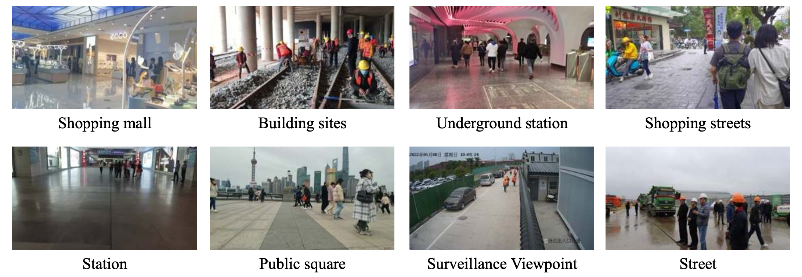
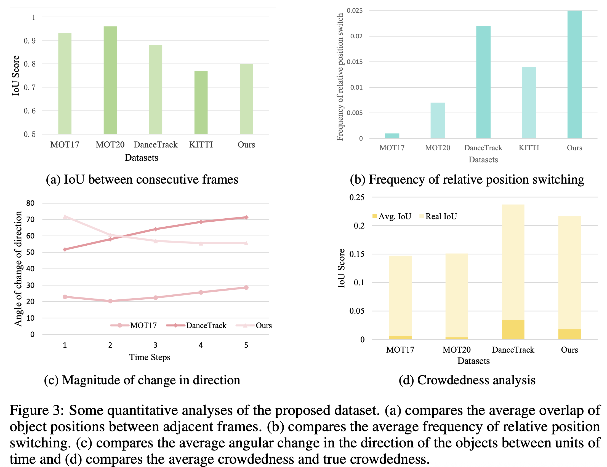
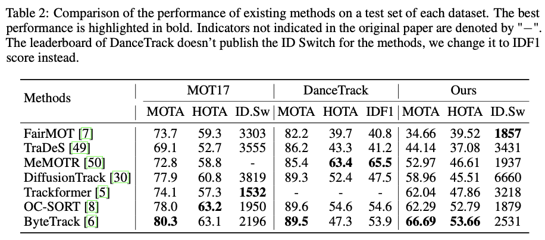

# CrowdTrack
[](https://arxiv.org/abs/2502.19958)

## Official repository of the dataset CrowdTrack in paper: CrowdTrack: A Benchmark for Difficult Multiple Pedestrian Tracking in Real Scenarios

## 📝 Scenario distribution of the dataset
  


## 📝 Statistical characterization of the data set
  


## 📝 Paper (Preprint)
Our work is available on arXiv: **[arXiv:XXXX.XXXXX](https://arxiv.org/abs/XXXX.XXXXX)** 

## 🚀 Leader Board
 
<!-- 1. **Installation**  
   ```bash
   pip install -r requirements.txt -->